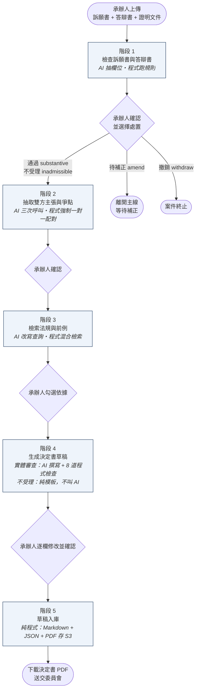
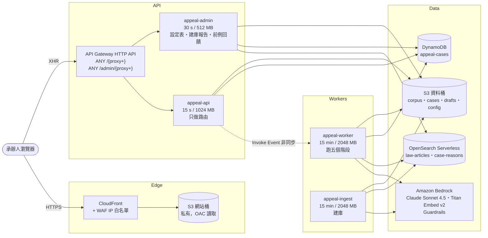

# 訴願案件助審系統 (Appeal Case Review Assistant)

新北市政府 AI 黑客松・法制局命題「新北市訴願案件審理作業流程之 AI 輔助應用」


> **AI 不做決定，決定的人始終是承辦人。**
>
> 承辦人上傳訴願書與答辯書，系統分五個階段產出決定書草稿，每一階段都由承辦人確認才往下。
> 有沒有逾期靠程式算，不靠 AI 猜；AI 只能提醒「可疑」，不能判「成立」；
> 草稿只能引用承辦人勾選的法條與前例，再過 8 道程式檢查；每一段輸出都標記出自程式或 AI，事後追得到。

---

## 目錄

- [問題](#問題)
- [系統怎麼運作](#系統怎麼運作)
- [系統架構 (AWS)](#系統架構-aws)
- [資料集與知識庫](#資料集與知識庫)
- [AI 安全與可追溯設計](#ai-安全與可追溯設計)
- [專案結構](#專案結構)
- [快速開始](#快速開始)
- [API 一覽](#api-一覽)
- [測試](#測試)
- [實測數據](#實測數據)
- [目前狀態與已知限制](#目前狀態與已知限制)
- [競賽規範對應](#競賽規範對應)
- [授權與資料聲明](#授權與資料聲明)

---

## 問題

新北市訴願案量從 110 年的 1,238 件成長到 114 年的 1,566 件（+26.5%），以洗錢防制法、廢棄物清理法、空氣污染防制法案件為大宗。命題文件指出兩個痛點：

| 痛點 | 現況 |
|---|---|
| 大量同類型訴願案，分散撰擬書稿效率 | 處分依據與論理架構高度規律，但每一件都要承辦人逐一撰擬與校對 |
| 實務見解更新，仰賴人工檢索 | 法規與函釋量大，人工檢索耗時且易遺漏，決定書有法理涵攝不周、事後被法院撤銷的風險 |

命題要求的四項功能與本系統的對應：

| 命題要求 | 本系統 |
|---|---|
| (1) 案件資訊擷取與分類 | 階段 1：抽訴願書結構化欄位、從答辯書判斷法規類型、訴願法 §56 / §77 程序檢查 |
| (2) 智能法規推薦 | 階段 3：對 `law-articles` 索引做混合檢索，依法規位階排序，附原文與來源 PDF |
| (3) 相似案例比對 | 階段 3：對 `case-reasons` 索引以主張比主張，回傳歷史決定書的主張、機關答辯與結果 |
| (4) 決定書草稿生成 | 階段 4 / 5：主文、事實、理由三段草稿，承辦人可逐欄修改並匯出官方格式 PDF |

服務對象是**法制局承辦人**。法制局是幕僚角色，整理卷證並擬具處理意見；最終決定由訴願審議委員會作成。系統負責「找資料」和「照格式寫」，**法律判斷仍然是承辦人的**。

---

## 系統怎麼運作

整套系統分成兩條互相獨立的流程：

```
流程 1（前置建庫）  法制局的 141 份 PDF          →  兩個 OpenSearch 索引（做一次，之後增量維護）
流程 2（訴願作業）  一件新案（訴願書 + 答辯書）  →  決定書草稿（每件跑一次，用流程 1 的索引）
```

### 流程 2：五個階段，每一階段都要承辦人確認



| 階段 | 誰做 | 輸出 |
|---|---|---|
| 1 檢查訴願書與答辯書 | PDF 抽字（程式）→ 抽 15 個結構化欄位（AI）→ 訴願法 §56 格式檢查與 §77 期間計算（**純程式**）→ 三款無法計算的不受理事由給「可疑」提示（AI） | 欄位、格式檢查、程序檢查、期間計算鏈、建議處置 |
| 2 抽取雙方主張與爭點 | 訴願書、答辯書各抽一次主張（AI），配成一對一爭點（AI 配、**程式強制一對一**） | 主張（附原文引句）、爭點、未配對主張（= 機關漏答） |
| 3 檢索法規與前例 | 主張改寫成法律用語（AI）→ BM25 + 向量混合檢索（程式）→ 依位階自動勾選（程式） | 每條主張的法規依據與相似前例，含分數與來源 |
| 4 生成決定書草稿 | 實體審查：AI 撰寫，只能引用勾選依據，過 8 道程式檢查；不受理：純模板填空 | 主文、事實、理由 + 11 個決定書欄位 + 給承辦人看的「AI 判斷脈絡」 |
| 5 草稿入庫 | 純程式 | Markdown、JSON 稽核包、決定書 PDF 存 S3 |

### 兩個貫穿全系統的原則

**① 程式判斷得了的，不要交給 AI。**
期間計算是兩個日期相減、欄位有沒有填是看是不是空的、引用範圍是比對清單。這些全部用程式，因為承辦人對「程式算出來的」和「AI 判斷的」信任程度不同。每個階段的回傳都標明 `used_ai` 與 `ai_calls`：

```json
{
  "used_ai": true,
  "ai_calls": [
    {"purpose": "生成決定書草稿",
     "model": "us.anthropic.claude-sonnet-4-5-20250929-v1:0",
     "tokens_in": 15119, "tokens_out": 2149, "elapsed_ms": 20648}
  ]
}
```

**② 系統可以提醒，不可以改承辦人的決定。**
處置方向（通過／不受理／待補正／撤銷）是承辦人選的。系統發現他選的方向有問題時只警示，仍照他選的方向產草稿。

「階段跑完了」和「承辦人同意了」是兩件事，用兩個正交的軸表示：

| 軸 | 誰決定 | 值 |
|---|---|---|
| `stage_status` | 系統 | `pending` / `running` / `done` / `confirmed` / `stale` / `failed` |
| `disposition` | 承辦人 | `substantive` 通過 / `inadmissible` 不受理 / `amend` 待補正 / `withdraw` 撤銷 |

---

## 系統架構 (AWS)

全部 Serverless，沒有一台伺服器要管。8 個 AWS 服務、4 支 Lambda，按用量計價。



四支 Lambda 共用一個 Layer `appeal-deps`（PyMuPDF、opensearch-py、requests-aws4auth，加上專案自己的 `common/`）。`appeal-api` 與 `appeal-worker` 是同一包 zip，只有 Handler 不同，拆的是執行環境不是程式碼。

| 服務 | 用途 |
|---|---|
| **Lambda** ×4 | 路由、五階段執行、建庫、管理端。記憶體給大是因為 Lambda 的 CPU 跟記憶體綁定，PDF 解析與向量化都吃 CPU |
| **API Gateway** (HTTP API) | 兩條 catch-all 路由，路徑在 Lambda 內自己拆，加端點不用動 API Gateway |
| **Amazon Bedrock** | 見下表 |
| **OpenSearch Serverless** | VECTORSEARCH collection，兩個索引，BM25 + kNN 混合檢索，`cjk` analyzer；閒置降到 0 OCU |
| **DynamoDB** | 單一資料表 `appeal-cases`（PK `case_id`、SK `sk`）：案件進度、各階段結果與歷史版本、稽核軌跡；超過 300 KB 自動改存 S3 |
| **S3** ×2 | 資料桶（語料、卷證、草稿、三張設定表、報告）與網站桶（前端靜態檔，Block Public Access 全開） |
| **CloudFront** + OAC + **WAF** | 前端 CDN，以 OAC 讀私有桶；WAF 預設 Block、只放行白名單 IP |
| **CloudWatch Logs** | 每個階段每一步都有日誌，含耗時與 verdict |

| Bedrock 用法 | 模型 | 角色 |
|---|---|---|
| Converse + forced tool use | `us.anthropic.claude-sonnet-4-5-20250929-v1:0` | 抽欄位、抽主張、配爭點、改寫查詢、寫草稿。`temperature=0`，輸出一律走 tool schema |
| Converse（選配） | `us.anthropic.claude-haiku-4-5-20251001-v1:0` | `MODEL_CHEAP`，未設時退回主模型 |
| InvokeModel | `amazon.titan-embed-text-v2:0` | 文字 → 1024 維向量，不做判斷 |
| ApplyGuardrail（選配） | Contextual grounding | 逐段檢查草稿是否超出勾選依據；未設 `GUARDRAIL_ID` 時退化為只做程式檢查 |

### 為什麼要非同步

API Gateway HTTP API 的整合逾時是 30 秒且不能調高，但階段 3 要跑 60–90 秒（每條主張三次 AI 呼叫加上 1 RPS 限流）。所以 `POST /cases/{id}/stages/{n}/run` 由 `appeal-api` 把工作以 `InvocationType="Event"` 丟給 `appeal-worker`，1 秒內回 202；前端每 3 秒輪詢 `GET /cases/{id}/stages/{n}` 直到 `done`。worker 若拋例外會把 `failed` 寫回 DynamoDB，畫面不會永遠轉圈。

### 刻意不用的服務

| 服務 | 為什麼不用 |
|---|---|
| Step Functions | 五個階段之間要人工確認才往下，不是自動流程；建庫所有動作在同一支 Lambda 用 `action` 分流，for 迴圈就夠，錯誤訊息也清楚得多 |
| SQS / EventBridge | 只有一個非同步交棒（api → worker），`InvocationType="Event"` 就解決了 |
| RDS / Aurora | 沒有關聯查詢的需求，案件狀態是「一個案號讀一整包」 |
| ECS / EC2 | 沒有常駐需求，最長的工作 15 分鐘內跑完 |
| Textract | 141 份 PDF 全部有文字層，PyMuPDF 抽得出來；Textract 的 OCR 語言清單不含中文 |
| Bedrock Knowledge Bases | 混合檢索的權重固定；本系統需要依實測調整 BM25 / 向量權重與門檻，所以自己組 OpenSearch 查詢 |

部署區域：`us-east-1`。

---

## 資料集與知識庫

法制局提供的資料集共 141 份 PDF（731 頁），分四類。四類的結構完全不同，所以各有各的解析方式；**只有「抽主張」一步用 AI，其餘全部是正則**，因為正則可重現、出錯看得出錯在哪一行。

| 資料類別 | 份數 | 切成幾筆 | 一筆 = | 索引 | 位階 | 用 AI？ |
|---|---:|---:|---|---|:---:|:---:|
| 相關法規 | 11 | 764 | 一條條文 | `law-articles` | 1 | ❌ |
| 司法院釋字及行政判解 | 19 | 112 | 主文／理由的一個分點 | `law-articles` | 2–3 | ❌ |
| 行政函釋 | 10 | 10 | 一整份 | `law-articles` | 4 | ❌ |
| 歷史訴願決定書 | 101 | 358 | 理由的一個分點 | `case-reasons` | — | ❌ |
| ↳ 訴願人主張 | （同上） | 69 | 一條主張 + 機關答辯 + 結果 | `case-reasons` | — | ✅ 唯一一步 |

```
law-articles   764 + 112 + 10 = 886     「可以引用的依據」
case-reasons   358 + 69      = 427      「以前的案子怎麼判」，只能學句型，不可引用
                               ─────
                               1,313 筆   （2026-09-13 從 /admin/corpus 實測）
```

**為什麼分兩個索引**：階段 3 拿主張去 `law-articles` 找「該引哪一條」，去 `case-reasons` 找「以前有人這樣主張過嗎」。實測主張對法條的向量相似度落在 0.62–0.75，主張對主張落在 0.80–0.93，是兩個不同的分布，要用兩個門檻，放同一個索引排名會互相干擾。

**混合檢索**：BM25（`cjk` analyzer 做 bigram）與 kNN 各查一次，各自 min-max 正規化後 0.5 / 0.5 加權，再以名次交錯融合。BM25 原始分數跨查詢不可比（實測同一批資料，一個查詢的最低分 19.3 高於另一個查詢的最高分 11.1），所以門檻一律用相對值。

**名稱統一（正名）**：三層，完全不用 LLM。字元正規化（汙→污、臺→台、NFC）→ 別名對照表（`config/aliases.json`，20 筆）→ 11 部法規的權威名稱清單。對不到的一律原樣保留並警示，不猜；用 Levenshtein 距離提示疑似錯字，門檻設計上刻意讓「行政訴訟法」與「行政執行法」不會被建議合併。

**評估隔離**：110–113 年決定書進索引，114 年保留為測試集，避免評估檢索效果時「檢索到自己」。

實測踩過、寫進程式註解與 preflight 檢查的坑：

- 法規 PDF 是雙欄排版，抽字不帶 `sort=True` 會讓第 79 條裝著第 76 條的內容，而且不報錯。
- 標楷體把部分漢字映到 CJK 相容字元區（例如「林」是 U+F9F4 不是 U+6797），肉眼一樣、codepoint 不同，BM25 與正名表全部無聲失效。用 NFC 正規化修掉，不用 NFKC（NFKC 會把決定書用來分段的全形空格也吃掉）。
- OpenSearch Serverless 向量 collection 不接受自訂 `_id`，重跑 load 只會產生重複，所以更新一律「先刪索引再重建」。
- 中文索引漏掉 `cjk` analyzer 不會報錯，只是 BM25 完全查不到東西。

---

## AI 安全與可追溯設計

決定書是行政處分，會被提行政訴訟。法官問「為什麼判不受理」時，「算式在這裡」答得出來，「AI 這樣說」答不出來。所以整個系統最重要的分界是：

| 結論 | 誰能給 | 為什麼 |
|---|---|---|
| 成立 | **只有程式**（算得出數字的） | 可重現、可複查、可交代 |
| 可疑 | AI | 推論，需要人確認；tool schema 裡沒有「成立」這個值 |
| 不成立 | 程式或 AI | 排除比認定安全 |
| 待確認 | 程式 | 要件鏈中有一環缺資料 |

### 階段 1：法定程序審查是資料驅動的規則引擎

規則存在 S3 的 `config/spec_rules.json`，引擎是 14 種可插拔的檢查方法。法制局可以在管理端改規則，60 秒內生效，不用重新部署。

| 檢查 | 條文 | 誰判 |
|---|---|---|
| 訴願人資料、代理人、原處分機關、請求事項、事實理由、收受日期、受理機關、證據、簽章、處分書影本 | 訴願法 §56 第 1 項各款、第 2 項 | 程式 |
| 提起訴願逾法定期間 | §77 第 2 款 | **程式**：送達日 + 1 起算、30 日屆滿，整條計算鏈顯示在畫面上；民國年格式全部支援 |
| 非處分相對人亦非利害關係人 | §77 第 3 款 | 程式比對姓名，AI 只給「可疑」 |
| 無訴願能力、法人未由代表人為之 | §77 第 4、5 款 | 程式（依民法 §12 算成年） |
| 行政處分已不存在 | §77 第 6 款 | AI 從答辯書找機關自行撤銷的紀錄，只給「可疑」 |
| 重行提起訴願 | §77 第 7 款 | 程式查同一訴願人與處分字號 |
| 逾期不補正、對非行政處分提起 | §77 第 1、8 款 | 人工（附 AI 說明） |

規則的可靠度不會超過輸入的可靠度：日期若是 AI 以低信心抽出的，結論會標示為不可靠。所有檢查都附白話說明與原文引句，說明層只解釋、不改任何一條的結果。

### 階段 4：引用防線是疊起來的

1. 只有承辦人在階段 3 勾選的依據會進 prompt；清單為空時**拒絕生成**，而不是讓模型自由發揮（實測清單清空模型就開始編法條）。
2. 主文由承辦人選的處置決定，不由模型決定；程式再驗一次。
3. `citations` 陣列逐筆比對勾選清單。
4. 內文再掃一次清單外的法條名稱（抓到過「訴願法第 15 條」被寫成「洗錢防制法第 15 條」）。
5. 內部詞彙 blocklist，防止系統用語或 snake_case 識別字流進要送達的公文。
6. 所有 enum 在 Python 端再驗一次，因為 Bedrock tool use 不強制 enum。
7. Bedrock Guardrails contextual grounding 逐段檢查，被擋的段落換成「本點所涉事實需承辦人補充卷內證據後自行敘明」，原文保留在稽核包。
8. 不受理路徑完全不叫 AI，內容全是規則引擎算出的數字。

### 其他

- **草稿不進索引。** 階段 5 只存 S3。定案發文後由管理端 `POST /admin/cases/{id}/finalize`（需 `confirm: true`）才寫進 `case-reasons`，避免 AI 引用自己上週寫的草稿當前例。
- **Bedrock ≤ 1 RPS** 是競賽規定。`common/bedrock.py` 在每次呼叫前用全域鎖限流（`BEDROCK_MAX_RPS`，預設 1），四個呼叫點全部經過。
- **欄位級 staleness。** 承辦人補一個生日不會讓三個階段重跑；每個欄位對應到它真正影響的階段（`config/field_impact.json`），未列出的欄位保守處理。
- **歷史版本不刪。** 承辦人潤過的草稿存為 `stage#4#v1`，重跑不會沖掉。
- **稽核軌跡。** 每一次執行、修改、確認都寫 `audit#<時間>` 紀錄誰在哪一步改了什麼。

---

## 專案結構

```
.
├── backend/                      Python 3.12，四支 Lambda + 部署腳本
│   ├── common/                   共用模組，打包進 Layer：回應外殼、規則引擎、Bedrock 限流、
│   │                             OpenSearch 混合檢索、民國年期間計算、文字正規化、DynamoDB 狀態機
│   ├── prep/                     appeal-ingest：四類 PDF 解析、正名、向量化、寫索引、建庫報告
│   ├── review/                   appeal-api + appeal-worker：五個階段、不受理判斷、決定書 PDF
│   ├── admin/                    appeal-admin：設定表、前例回饋、暖機、語料統計
│   ├── tests/                    本機測試，不需要 AWS
│   ├── layer/                    Layer 打包腳本與 requirements
│   ├── provision_*.py            建 OpenSearch / API Gateway / S3 CORS / CloudFront
│   ├── deploy_lambdas.py         發 Layer 版本 + 建立或更新四支 Lambda
│   └── deploy_web.py             上傳前端建置產物並清 CloudFront 快取
├── frontend/                     React 19 + TanStack Start + TypeScript
│   ├── src/routes/               file-based routing：我的案件、建案、五個步驟頁、管理頁
│   ├── src/api/                  API client、React Query hooks、後端形狀 → UI 模型的 adapters
│   ├── src/components/           AppShell、檢核清單、AI 判斷脈絡面板、原文預覽
│   └── docs/plans/               UI 設計文件
├── LICENSE
└── README.md
```

---

## 快速開始

### 前置需求

- AWS 帳號，區域 `us-east-1`；Bedrock 已開通 Claude Sonnet 4.5、Claude Haiku 4.5、Titan Text Embeddings V2
- 手動建好：S3 資料桶、DynamoDB 表 `appeal-cases`（PK `case_id` S、SK `sk` S、on-demand）、IAM 角色 `appeal-lambda-role`
- Python 3.12、PowerShell（打包腳本為 `.ps1`）、Node ≥ 20 與 bun（或 npm）

### 後端部署

```bash
cd backend
cp .env.deploy.example .env.deploy        # 填 APPEAL_BUCKET、AWS_DEFAULT_REGION
source .env.deploy

python provision_aoss.py                  # 建 OpenSearch Serverless，印出 OS_ENDPOINT → 填回 .env.deploy
python provision_s3_cors.py               # 沒有這步瀏覽器無法直傳 S3
./layer/build.ps1                         # 打包 Layer（第一次或相依套件變動時）
./package.ps1                             # 打包 dist/*.zip
python -m tests.preflight                 # 本機靜態檢查
python deploy_lambdas.py                  # 發 Layer + 四支 Lambda
python provision_apigw.py                 # 建 HTTP API，印出 API_BASE → 填回 .env.deploy

curl "$API_BASE/selftest"                 # 逐項回報缺哪個環境變數
```

### 建庫（一次性，可續傳）

對 `appeal-ingest` 依序送測試事件；`load` 回 `partial: true` 時帶 `next_offset` 再跑一次：

```json
{"action": "rebuild_indexes"}
{"action": "parse", "category": "laws"}            {"action": "load", "category": "laws"}
{"action": "parse", "category": "precedents"}      {"action": "load", "category": "precedents"}
{"action": "parse", "category": "interpretations"} {"action": "load", "category": "interpretations"}
{"action": "parse", "category": "decisions"}       {"action": "load", "category": "decisions"}
{"action": "extract_claims"}
{"action": "report"}
{"action": "verify_search"}
```

### 前端

```bash
cd frontend
bun install                               # 或 npm install
cp .env.local.example .env.local          # 只有一個變數：VITE_API_BASE=<API_BASE>，結尾不加斜線
bun run dev                               # 改過 .env.local 要重啟

bun run build                             # 產出 .output/public/
cd ../backend && python provision_web.py  # S3 + OAC + CloudFront + WAF，印出 WEB_BUCKET / WEB_DIST_ID
python deploy_web.py                      # 上傳並清快取
```

未設定 `VITE_API_BASE` 時畫面會明確顯示未連線。前端**沒有假資料**，避免評審或承辦人把示範資料當成真卷證。

### 示範前

OpenSearch Serverless 閒置約 10 分鐘會降到 0 OCU，第一次查詢要等 30 秒以上。示範前 15 分鐘打 `POST <API_BASE>/admin/warmup`。

---

## API 一覽

回應一律 `application/json; charset=utf-8`；錯誤為 `{"error": "<給承辦人看的訊息>", "hint": "<怎麼修>"}`。

**案件 API（`appeal-api`）**

| Method | Path | 用途 |
|---|---|---|
| `GET` | `/selftest` | 環境變數與 Layer 健康檢查 |
| `POST` | `/cases` | 建立案件，回傳訴願書、答辯書、證明文件的 presigned 上傳網址 |
| `GET` | `/cases` | 案件列表（含反正規化的摘要，一次請求就能畫清單） |
| `GET` | `/cases/{id}` | 案件進度、五階段狀態、下一個可執行的階段 |
| `GET` | `/cases/{id}/stages/{n}` | 讀某階段結果（輪詢端點；`?version=` 讀歷史版本） |
| `POST` | `/cases/{id}/stages/{n}/run` | 非同步執行，回 202 |
| `PATCH` | `/cases/{id}/stages/{n}/fields` | 承辦人修改欄位、主張、勾選、草稿；回傳受影響而過期的階段 |
| `POST` | `/cases/{id}/stages/{n}/confirm` | 確認；階段 1 需帶 `disposition` |
| `GET` | `/cases/{id}/audit` | 稽核軌跡 |
| `GET` | `/cases/{id}/decision.pdf` | 決定書 PDF 的 presigned 網址 |
| `GET` | `/sources?kind=&file=` | 法規、判解、函釋、決定書原始 PDF 的 presigned 網址 |

**管理 API（`appeal-admin`）**

| Method | Path | 用途 |
|---|---|---|
| `GET` | `/admin/selftest` | 健康檢查 |
| `POST` | `/admin/warmup` | 喚醒 OpenSearch Serverless |
| `GET` | `/admin/corpus` | 即時索引統計（依位階、文件類型、單元類型） |
| `GET` / `PUT` | `/admin/config`、`/admin/config/{name}` | 讀寫 `spec_rules` / `aliases` / `field_impact`，寫入前驗證 |
| `POST` | `/admin/cases/{id}/finalize` | 定案後把該案寫進 `case-reasons` 當前例 |
| `POST` | `/admin/cases/{id}/unfinalize` | 反向操作，測試用 |

目前 API Gateway 未掛認證；`_actor()` 已預留讀取 Cognito JWT claims，加上認證後後端程式不用改。

---

## 測試

後端測試全部在本機跑，不需要 AWS：

```bash
cd backend
python -m tests.preflight          # zip 結構、import、AOSS 不支援的 API、已知地雷（AWS_REGION、NFKC、sort=True…）
python -m tests.test_rules         # 規則引擎 vs 訴願書樣本的標準答案，要求 100% 一致
python -m tests.test_retrieval     # 分數融合與門檻邏輯
python -m tests.test_draft         # 階段 4 的程式端：不受理模板、只吃勾選依據、段落檢查
python -m tests.test_api_shapes    # 前端契約：欄位存在且命名正確
```

前端目前沒有自動化測試，只有 `bun run lint`。

---

## 實測數據

| 項目 | 數值 | 說明 |
|---|---|---|
| 語料 | 141 份 PDF / 731 頁 → 1,313 筆索引 | `law-articles` 886、`case-reasons` 427 |
| 決定書標頭抽取 | 101 / 101 | 六個欄位全部抽出 |
| 規則引擎 vs 標準答案 | 100% | `tests/test_rules.py` |
| 每件案子跑完五階段 | 約 2.5 分鐘 | 1 RPS 限流下 |
| 案件 1146030003（逾期洗錢案） | 階段 1 20.9 s、階段 2 20.6 s、階段 3 25.5 s | 逾期 678 日；4 + 3 條主張、3 個爭點、1 條機關漏答；檢索 74 筆、自動勾選 16 筆 |
| 決定書 PDF 產生 | 約 300 ms、3 頁、51 KB | 內嵌並子集化 CJK 字型，含禁則處理 |
| 混合檢索（BEIR 公開量測） | 純向量 −6.97%、混合 +8.12% | 選擇 min-max + 算術平均而非 RRF 的依據 |

效益估算：若 1,566 件中半數適用、每件節省 20 分鐘，約 261 小時／年。**這是情境假設，不是市府實測。** 本專案沒有正式的離線評估結果，只有規劃中的評估方案。

---

## 目前狀態與已知限制

| 項目 | 狀態 |
|---|---|
| 流程 1 建庫 | ✅ 141 份全部進庫 |
| 流程 2 五個階段 | ✅ 實體審查、不受理兩條路實測跑通 |
| 管理端（設定表、建庫報告、前例回饋、暖機） | ✅ |
| 前端接後端、無假資料 | ✅ |
| 決定書 PDF 匯出 | ✅ |
| 認證（Cognito / API Gateway authorizer） | 🚧 未做。HTTP API 不支援 WAF，IP 白名單只保護前端不保護 API，因此本 repo 不公開 API 網址 |
| Bedrock Guardrails | 🚧 `GUARDRAIL_ID` 未設，目前只靠程式端檢查 |
| §77 各款的 AI 違規檢查與不受理路徑的法條檢索 | 🚧 第 3、6、8 款有「可疑」提示；不受理草稿的法條原文檢索只有殼 |
| 補正、撤銷後續流程 | 🚧 需求未定 |
| 圖片證明文件 OCR | 🚧 只保存與列出，不進檢索（Textract 不支援中文，待評估 Bedrock 視覺模型） |
| 長證明文件檢索 | 🚧 只取前 1,500 字 |
| 前例統計母體 | ⚠️ 101 件決定書中僅 24 件實體審查可抽主張，統計意義弱，畫面上會標明母體 |
| 各階段 prompt | ⚠️ 寫在程式裡，三張設定表可線上改，prompt 不行 |
| 行政程序法 §48 假日順延 | ⚠️ 未實作，可能把落在假日的末日誤判逾期 1–3 天，畫面會提醒 |

---

## 競賽規範對應

| 規範 | 作法 |
|---|---|
| 不得建立公開對外的 S3 Bucket | 兩個桶 Block Public Access 四項全開；前端用 CloudFront OAC 讀私有桶，不用 S3 靜態網站託管 |
| Bedrock 請求 ≤ 1 RPS | `common/bedrock.py` 全域鎖限流，四個呼叫點全部經過；`EMBED_WORKERS=1`。建庫與案件流程不同時跑 |
| 程式碼不得含機密憑證 | 根目錄與子目錄 `.gitignore` 擋 `.env*`，只提交 `.env.deploy.example` 與 `.env.local.example`；API 網址視同憑證，不寫進 repo |
| 部署於 us-east-1 / us-west-2 | us-east-1 |
| 基礎模型限 Bedrock / SageMaker | 全部走 Bedrock |

---

## 授權與資料聲明

程式碼以 [MIT License](LICENSE) 釋出。

法制局提供的 141 份資料集（歷史訴願決定書、相關法規、行政函釋、司法院釋字及行政判解）**僅供競賽之用，不包含在本 repo 內**。示範案件中的當事人資料均為虛構。
